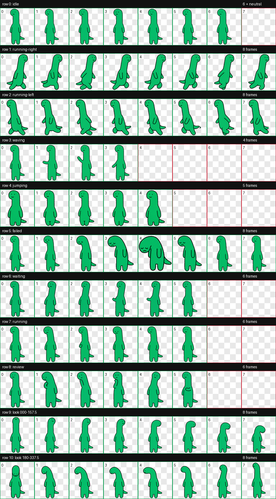

<div align="center">

# 🦕 Brachio — Codex Desktop Pet

### Long neck. Tiny steps. Big support.


[](https://github.com/topics/codex-pet)
[](#-install)
[](#-notice)

**[English](#english) · [한국어](#한국어)**

</div>

---

<a id="english"></a>

## English

Brachio is a tiny animated **green brachiosaurus desktop pet** for the
**Codex desktop app**. He reacts while Codex works, waits, reviews, succeeds,
or needs your attention—usually with the same calm, slightly blank smile.

That quiet expression, the tiny sideways tail, and the long flexible neck are
his whole charm. He does not interrupt. He simply stays nearby.

### ✨ What is included?

- 9 animated work states: idle, move, wave, jump, fail, wait, work, and review
- 16 smooth look directions
- Hand-drawn emerald-green body with a thick, wobbly black outline
- Transparent Codex v2 sprite atlas
- One-command Windows installer

## 🚀 Install

### Option 1 — Quick install with PowerShell

1. Open the **Start menu**.
2. Search for **PowerShell** and open it.
3. Copy the command below, paste it into PowerShell, and press **Enter**.

```powershell
irm https://raw.githubusercontent.com/iamdw1788/brachio-codex-pet/main/install.ps1 | iex
```

4. Open **Codex**.
5. Go to **Settings → Pets**.
6. Press the **refresh ↻ button** near the top of the pet list.
7. Find **Brachio** and press **Select**.

> You do not need to run PowerShell as Administrator.

### Option 2 — Manual install

Use this if you prefer not to run a remote PowerShell script.

1. Download [`pet.json`](./pet.json) and
   [`spritesheet.webp`](./spritesheet.webp).
2. Press `Win + R`, paste the following path, and press **Enter**:

```text
%USERPROFILE%\.codex\pets
```

3. Create a folder named `brachio`.
4. Put both downloaded files inside it:

```text
.codex/
└── pets/
    └── brachio/
        ├── pet.json
        └── spritesheet.webp
```

5. In Codex, open **Settings → Pets**, press **refresh ↻**, and select
   **Brachio**.

## 🔄 Update

Run the quick-install command again. It safely replaces the two pet files with
the latest version:

```powershell
irm https://raw.githubusercontent.com/iamdw1788/brachio-codex-pet/main/install.ps1 | iex
```

Then refresh the pet list or restart Codex.

## 🧹 Uninstall

Close Codex, open PowerShell, and run:

```powershell
Remove-Item -LiteralPath "$env:USERPROFILE\.codex\pets\brachio" -Recurse
```

This removes only Brachio. Your other Codex pets are untouched.

## 🛠️ Troubleshooting

### Brachio does not appear in the pet list

- Check that the folder is exactly `.codex\pets\brachio`.
- Check that it contains both `pet.json` and `spritesheet.webp`.
- Press the refresh button in **Settings → Pets**.
- Fully quit and reopen Codex if refresh does not help.

### Brachio appears, but the old design is still shown

Run the update command again, then fully quit and reopen Codex. The installer
overwrites the existing `brachio` files.

### PowerShell says script execution is disabled

The quick command does not save or run a local `.ps1` file, but managed work
computers may still block it. Use the manual installation steps instead.

## 🎞️ Animations



---

<a id="한국어"></a>

## 한국어

브라키오는 Codex 데스크톱 앱에서 함께 지내는 작고 초록색인
**브라키오사우루스 데스크톱 펫**입니다.

Codex가 작업하거나 기다리고, 결과를 검토하고, 도움이 필요할 때 상태에
맞춰 움직입니다. 무심한 듯 다정한 표정, 조그만 옆꼬리, 길고 유연한
목이 브라키오의 매력입니다.

### ✨ 들어 있는 동작

- 쉬기, 이동, 인사, 점프, 실패, 기다림, 작업 중, 검토 등 9가지 상태
- 자연스럽게 이어지는 16방향 시선
- 에메랄드 초록색과 굵고 삐뚤빼뚤한 검은 손그림 외곽선
- 투명 배경의 Codex v2 스프라이트

## 🚀 설치하기

### 방법 1 — PowerShell로 간편 설치

1. Windows **시작 메뉴**를 엽니다.
2. `PowerShell`을 검색해 **Windows PowerShell**을 실행합니다.
3. 아래 명령을 복사해 PowerShell 창에 붙여 넣고 **Enter**를 누릅니다.

```powershell
irm https://raw.githubusercontent.com/iamdw1788/brachio-codex-pet/main/install.ps1 | iex
```

4. **Codex**를 실행합니다.
5. **설정 → 반려동물**로 이동합니다.
6. 펫 목록 위쪽의 **새로고침 ↻ 버튼**을 누릅니다.
7. **Brachio**를 찾아 **선택**을 누릅니다.

> 관리자 권한으로 PowerShell을 실행할 필요는 없습니다.

### 방법 2 — 직접 설치

인터넷에서 PowerShell 스크립트를 실행하고 싶지 않다면 이 방법을
사용하세요.

1. [`pet.json`](./pet.json)과
   [`spritesheet.webp`](./spritesheet.webp)를 내려받습니다.
2. `Win + R`을 누르고 아래 경로를 붙여 넣은 다음 **Enter**를 누릅니다.

```text
%USERPROFILE%\.codex\pets
```

3. `brachio`라는 새 폴더를 만듭니다.
4. 내려받은 파일 두 개를 그 안에 넣습니다.

```text
.codex/
└── pets/
    └── brachio/
        ├── pet.json
        └── spritesheet.webp
```

5. Codex의 **설정 → 반려동물**에서 **새로고침 ↻**을 누르고
   **Brachio**를 선택합니다.

## 🔄 업데이트하기

간편 설치 명령을 다시 실행하면 최신 파일로 안전하게 덮어씁니다.

```powershell
irm https://raw.githubusercontent.com/iamdw1788/brachio-codex-pet/main/install.ps1 | iex
```

실행 후 펫 목록을 새로고침하거나 Codex를 다시 시작하세요.

## 🧹 삭제하기

Codex를 종료하고 PowerShell에서 아래 명령을 실행합니다.

```powershell
Remove-Item -LiteralPath "$env:USERPROFILE\.codex\pets\brachio" -Recurse
```

브라키오 폴더만 삭제되며 다른 펫에는 영향을 주지 않습니다.

## 🛠️ 문제 해결

### 펫 목록에 브라키오가 안 보여요

- 폴더 경로가 정확히 `.codex\pets\brachio`인지 확인합니다.
- 폴더 안에 `pet.json`과 `spritesheet.webp`가 모두 있는지 확인합니다.
- **설정 → 반려동물**에서 새로고침 버튼을 누릅니다.
- 그래도 안 보이면 Codex를 완전히 종료했다가 다시 실행합니다.

### 예전 모습이 계속 보여요

업데이트 명령을 다시 실행한 뒤 Codex를 완전히 종료했다가 실행하세요.
설치 프로그램이 기존 `brachio` 파일 두 개를 최신 버전으로 덮어씁니다.

### 회사 컴퓨터에서 PowerShell 명령이 차단돼요

보안 정책이 적용된 컴퓨터에서는 명령이 제한될 수 있습니다. 이 경우
위의 **직접 설치** 방법을 사용하세요.

## 🎞️ 전체 동작


---

## 📁 Package

```text
brachio-codex-pet/
├── pet.json
├── spritesheet.webp
├── install.ps1
└── assets/
    ├── brachio-idle.gif
    ├── preview.png
    └── contact-sheet.png
```

## 📌 Notice

This is an unofficial, non-commercial fan-made green dinosaur pet. It is not
affiliated with or endorsed by OpenAI or any character studio. Original
character-related rights belong to their respective rights holders.

Please do not sell or commercially redistribute the character assets.

## ⭐ Like Brachio?

If this quiet little dinosaur made your coding day nicer, please leave a star.
It helps more Codex users find him.


